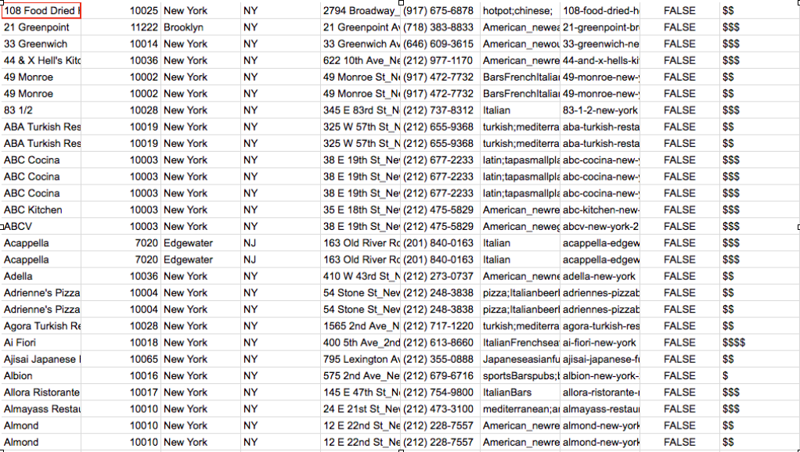
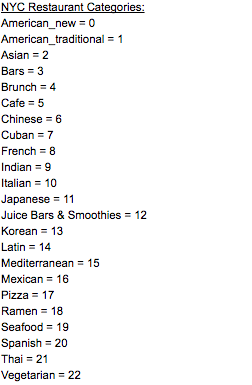
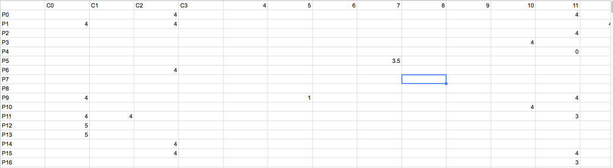
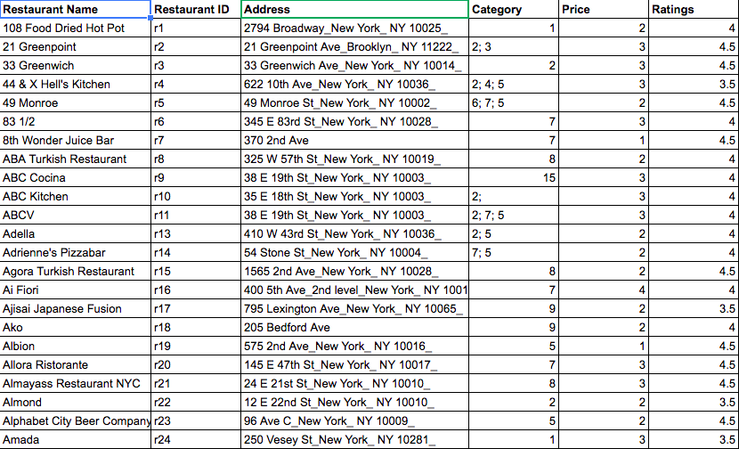
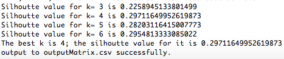
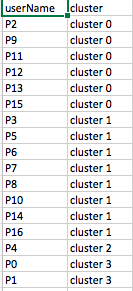
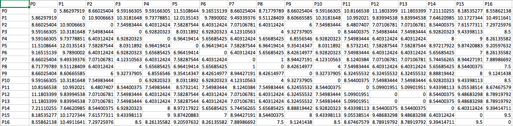
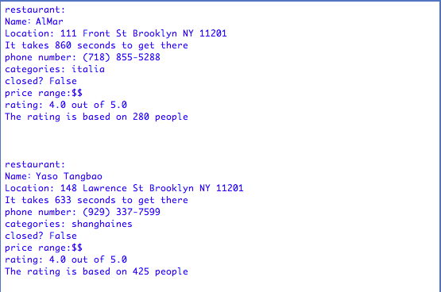
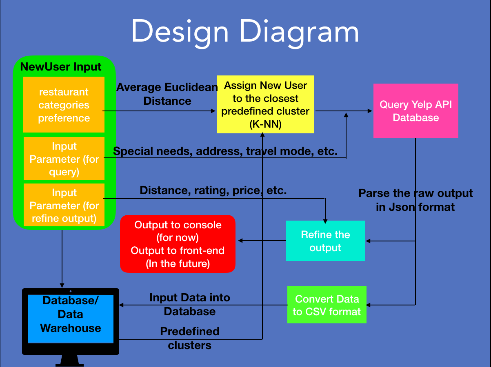

# Data-Science-Collaborative-Food-Recommender-System

## Overview

This project aims to create a collaborative food/restaurants recommender system by integrating multiple machine learning algorithms. The model tries to provide accurate prediction and suggestions to what users might like. 
 
The project follows the procedures of "Cross-industry Standard Process For Data Mining" (CRISP-DM), which is a data mining process that commonly uses in industries to tackle problems. CRISP-DM breaks problems into ___six phases___: 
* Business Understanding
* Data Understanding
* Data Preparation
* Modeling
* Evaluation
* Deployment
 
Each phase has been described in detailed below.
 
 
# Developers:
Xuebo Lai, Isaac Blinder, Christian Miljkovic, Arjun Madgavkar, Greg Ha
 

## Business Understanding

* Background: currently people eat inefficiently because they are lazy and have limited time/money
* Objectives: create a recommendation system that helps people eat according to their budget, according to their health goals, and within their dietary restrictions
* Success: over 60% of recommendations given are used on a daily basis

## Data Understanding:
 
    Data Collection:

* In order to obtain information on the restaurants in Manhattan, data are collected from Yelp on thousands of restaurants in Manhattan. As well as surveyed over 100 people in order to know their preferences and backgrounds.

 
 
    Data Description:

* Yelp Fusion API Data
    * thousandrows of restaurant 
    * Number of restaurants will increase as user queries the system. (Special  mechanism of our recommender system)
    * Features include: name, zip code; address; category; price; rating; number of reviews 
    * Address will be used to calculate the accurate travel time
* User Matrix
    * Need to get information about user preferences
    * 16 rows, each is 1 user
    * 23 columns in each row (each column stands for a food restaurants/categories)
    * Ratings within each column for each user
 

Sample parsed data from Yelp before further processing:

 
 
Sample aggregated categoies for restaurants:
 

 
 
Sample users to restaurants category matrix:
 

 
 

## Data Preparation:
* cleaned the data for missing values that might be within the Yelp API Restaurant data. For numerical data, such as the ratings, averages based on user data were used. 

* created aggregated categories for the many different types of restaurants the Yelp API contained.

* Some of the restaurants in the user data were missing from the Yelp API so their information had to be entered manually

* Then performed feature selection to remove unnecessary features such as “Phone Number” and low variance features such as location (since we were just focusing on NY)

* Next mapped all categorical data to numerical values, and fill in any empty values or Na’s with 0 or the mean depending upon the feature.

* A particularly tricky feature was the restaurant categories as many had several, thus split and expanding the data frame was needed in order to complete this step.

Sample parsed Data from Yelp after processing (feature selection, normalization, quantification, etc.)
 

 
 

## Modeling:

* Data Clustering:
The K-Means++ algorithm in Java Common Math Library is used to cluster similar people.  
The people were distinguished by their age, price range and food preference.
Result shows that there are four distinguishable clusters in the data.

Finding the best group number (way to group) by using Silhoutte Score
 

 
 
Clustering output
 

 
 

* Similarity Matrix:
    * Since collaborative filtering are used for modeling, we want to create similarity matrix between all the users for reference and in case we want to customize k means plus plus or k-nn algorithm in the future. 

    * Euclidean distance is used as the similarity measure because the most accurate recommendations would be due to similar preferences and location between individuals

    * Each row and column represents an individual and the value is the similarity between them.

Similiarty Matrix Between Users
 

 
 

* Data Classification:
    * Take in information about new users and their restaurant preference
    * Calculate the average Euclidean distance from the new user to all clusters
    * Place new user into the closest cluster based average distance (K-NN: average)

From here, there are two ways to proceed:

* First way: We can look into the shared charateristics of people in the group that the new users are in and use those information to query Yelp Restaurant's API to obtain a list of recommended restaurants. Then based on user specific preference, some of the restaurants in the list will be ruled out and the rest will be used as result. The result will be ranked and show to users. The restaurants we obtained from yelp by this way will be stored into database. This approach is mainly used to avoid cold start, since it's hard to obtain a large amount restaurants from yelp at once. (The yelp restaurants api has restriction on how many restaurants that one user can obtain through querying within certain amount of time.)

* Second way: Assumming we already have had enough data in resturants, we can use item-based approach. By normalizing all restaurants' features (address,rating, number of rating, categories, etc.) and creating their similiarty matrix based on Euclidean distance, we can find a list of restaurants that fit into users' past habits or current requirement. Then based on users' request, we can futher refine the list and output the result. The shortcoming of this method is the cold start problem: we might not have enough restaurants to make accurate prediction in the beginning.

 
 
Results (sample output without front-end)
 

 
 

 
Modeling Diagram:

 
Modeling Design Algorithm
 

 
 

# References:

1. [Definition and formula of Silhouette Score] (https://en.wikipedia.org/wiki/Silhouette_(clustering))
2. [Cross Industry Standard Process for Data Mining] (https://en.wikipedia.org/wiki/Cross-industry_standard_process_for_data_mining)
3. [Java external library Common Math: The Apache Commons Mathematics Library] (http://commons.apache.org/proper/commons-math)

